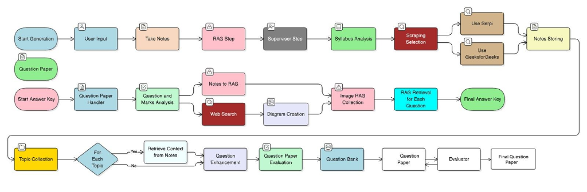

# ScoriX Agent 🎓

> **Status**: 🚧 Work in Progress

An intelligent, centralized educational management system that leverages AI agents to automate question paper generation, handwritten answer sheet evaluation, and student performance analysis.



---

## 📋 Table of Contents

- [Overview](#overview)
- [Key Features](#key-features)
- [System Architecture](#system-architecture)
- [Core Components](#core-components)
- [Installation](#installation)
- [Usage](#usage)
- [API Documentation](#api-documentation)
- [Project Structure](#project-structure)
- [Technologies Used](#technologies-used)
- [Roadmap](#roadmap)
- [Contributing](#contributing)
- [License](#license)

---

## 🎯 Overview

**ScoriX Agent** is an AI-powered educational platform designed to revolutionize the way educators create assessments and evaluate student performance. The system combines multiple AI agents, advanced RAG (Retrieval-Augmented Generation) systems, and computer vision to provide:

- **Automated Question Paper Generation** with intelligent topic selection
- **Handwritten Answer Sheet Evaluation** using OCR and AI analysis
- **Automatic Answer Key Generation** from question papers
- **Student Identification** and performance tracking
- **Diagram Recognition** and analysis for technical subjects
- **Multi-Vector Search** for efficient content retrieval

---

## ✨ Key Features

### 🤖 Multi-Agent Architecture

The system employs a **QUAL (Quality Assurance Loop)** agent architecture with specialized agents:

- **Content Collector Agent**: Web scraping from educational resources (W3Schools, GeeksForGeeks, NPTEL, MIT OCW, OpenStax, University EDU sites)
- **Question Generator Agent**: Creates questions based on Bloom's Taxonomy and difficulty levels
- **Evaluator Agent**: Validates questions for quality, repetition, and alignment with course outcomes
- **Supervisor Agent**: Orchestrates the workflow and ensures quality standards
- **RAG Agent**: Retrieves relevant content using hybrid search (dense + sparse vectors)

### 📝 Question Paper Generation

- **Intelligent Topic Selection**: Scrapes and analyzes educational content
- **Bloom's Taxonomy Classification**: Automatic cognitive level detection (Remember, Understand, Apply, Analyze, Evaluate, Create)
- **Difficulty Assessment**: Easy/Medium/Hard classification
- **Repetition Detection**: Semantic similarity-based duplicate detection
- **Course Outcome (CO) Mapping**: Aligns questions with learning objectives
- **Syllabus Analysis**: Automatically parses syllabus to extract topics

### 📄 Answer Sheet Evaluation

- **Handwritten Text Recognition**: OCR-powered text extraction
- **Student Identification**: Automatic detection of student information
- **Diagram Recognition**: Specialized image analysis for technical diagrams
- **Answer Key Generation**: AI-generated answer keys from question papers
- **Performance Analytics**: Class-wide and individual student performance tracking

### 🔍 Advanced RAG System

- **Multi-Vector Embeddings**: Uses ColBERT for fine-grained semantic search
- **Hybrid Search**: Combines dense and sparse embeddings for optimal retrieval
- **Qdrant Vector Database**: High-performance vector storage and search
- **FAISS Memory**: Efficient historical question storage
- **Metadata Filtering**: Search by topic, difficulty, taxonomy level, and more

---

## 🏗️ System Architecture

The system follows a modular, agent-based architecture with three main workflows:

### 1️⃣ Question Paper Generation Workflow

```
Topic Collection → Content Retrieval → Question Enhancement → 
Question Paper Evaluation → Question Bank → Final Question Paper
```

### 2️⃣ Answer Key Generation Workflow

```
Question Paper Handler → Question & Marks Analysis → 
Web Search → Diagram Creation → Image RAG → Final Answer Key
```

### 3️⃣ Answer Sheet Evaluation Workflow

```
Start Answer Key → Question Paper Handler → 
Notes to RAG → RAG Retrieval → Student Performance Analysis
```

---

## 🧩 Core Components

### Evaluator Agent

The evaluator agent validates generated questions using multiple criteria:

#### Features

- **Multi-Agent System**: Specialized agents for different validation tasks
- **Bloom's Taxonomy Classification**: Automatic cognitive level detection
- **Difficulty Assessment**: Easy/Medium/Hard classification
- **Repetition Detection**: Semantic similarity-based duplicate detection
- **Topic Classification**: Automatic topic and subtopic identification
- **AI-Powered Reasoning**: Improvement suggestions for questions needing changes
- **FAISS Memory**: Efficient vector storage for historical questions
- **CO-Based Processing**: Process questions per Course Outcome

#### Usage

**Process CO Questions from JSON:**
```bash
python process_co_questions.py "path/to/input.json"
```

**Process Single Question Set:**
```bash
python main.py "1) Question 1\n2) Question 2..."
```

#### Output

Results are saved to `output/co_validation_results_TIMESTAMP.json` with:
- Verdict (Valid/Invalid)
- All questions with taxonomy classification
- Reasoning for questions needing changes
- Issues summary
- Questions to change

### RAG Systems

Located in `ragSystems/`, includes:

- **Embedder**: Multi-vector and hybrid embedding generation
- **Qdrant Manager**: Vector database operations
- **RAG Processor**: Document processing and retrieval
- **Hybrid Search**: Combined dense + sparse retrieval

### Web Scrapers

Located in `services/scrapers/`, includes specialized scrapers for:

- W3Schools
- GeeksForGeeks
- NPTEL (with PDF support)
- MIT OpenCourseWare (with PDF support)
- OpenStax
- University EDU sites (with PDF support)

---

## 🚀 Installation

### Prerequisites

- Python 3.10+
- Node.js 16+ (for frontend)
- Qdrant (vector database)
- Google Gemini API key
- SerpAPI key (for web search)

### Backend Setup

```bash
# Clone the repository
git clone https://github.com/yourusername/scoriX_agent.git
cd scoriX_agent

# Create virtual environment
python -m venv .venv
source .venv/bin/activate  # On Windows: .venv\Scripts\activate

# Install dependencies
pip install -r requirements.txt

# Set up environment variables
cp .env.example .env
# Edit .env with your API keys
```

### Frontend Setup

```bash
cd frontend
npm install
```

### Qdrant Setup

```bash
# Using Docker
docker pull qdrant/qdrant
docker run -p 6333:6333 qdrant/qdrant
```

---

## 💻 Usage

### Start Flask API Server

```bash
python app_flask.py
```

The API will be available at `http://localhost:5000`

### Start Frontend (React)

```bash
cd frontend
npm run dev
```

The frontend will be available at `http://localhost:5173`

### Generate Question Paper

```bash
python generate_qp.py
```

### Test Question Paper Generator

```bash
python test.py
```

### Evaluate Answer Sheet

```bash
python imgEvaluator.py
```

---

## 📡 API Documentation

See [README_FLASK_API.md](README_FLASK_API.md) for detailed API documentation.

### Key Endpoints

- `POST /api/generate` - Generate question paper
- `POST /api/generate-from-file` - Generate from syllabus file
- `GET /api/generate-stream` - Stream generation progress (SSE)
- `POST /api/evaluate` - Evaluate answer sheet
- `GET /api/health` - Health check

---

## 📁 Project Structure

```
scoriX_agent/
├── agents/                    # AI agent implementations
├── evaluator agent/           # Question evaluation system
├── frontend/                  # React frontend application
├── ragSystems/               # RAG and vector search systems
│   ├── embedder.py           # Embedding generation
│   ├── qdrantManager.py      # Vector database management
│   └── ragProcessor.py       # Document processing
├── services/                 # Core services
│   ├── scrapers/            # Web scraping modules
│   ├── prompt/              # AI prompt templates
│   └── llm/                 # LLM integration
├── tools/                    # Utility tools
├── models/                   # Data models
├── routes/                   # API routes
├── outputs/                  # Generated outputs
├── app_flask.py             # Flask API server
├── generate_qp.py           # Question paper generator
├── imgEvaluator.py          # Answer sheet evaluator
├── test.py                  # Test suite
└── requirements.txt         # Python dependencies
```

---

## 🛠️ Technologies Used

### Backend

- **Python 3.10+**
- **Flask** - Web framework
- **LangChain** - LLM orchestration
- **Google Gemini** - Large language model
- **Qdrant** - Vector database
- **FAISS** - Vector similarity search
- **ColBERT** - Multi-vector embeddings
- **BeautifulSoup4** - Web scraping
- **Selenium** - Dynamic content scraping
- **PyPDF2** - PDF processing
- **Tesseract OCR** - Text recognition
- **Express and node** - For user Data management.
-  **MONGODB** - For user Data Storage and authentication process.

### Frontend

- **React** - UI framework
- **Vite** - Build tool
- **Axios** - HTTP client

### AI/ML

- **Google Gemini API** - Question generation and evaluation
- **SerpAPI** - Web search integration
- **KeyBERT** - Keyword extraction
- **Sentence Transformers** - Semantic embeddings

---

## 🗺️ Roadmap

### Phase 1: Core Functionality ✅ (In Progress)

- [x] Question paper generation
- [x] Multi-agent architecture
- [x] RAG system implementation
- [x] Web scraping modules
- [x] Evaluator agent
- [x ] Answer sheet evaluation
- [ x] Student identification

### Phase 2: Advanced Features 🔄

- [ ] Diagram recognition and analysis
- [ ] Performance analytics dashboard
- [ ] Multi-language support
- [ ] Batch processing
- [ ] Export to multiple formats (PDF, DOCX)

### Phase 3: Production Ready 📋

- [ ] User authentication and authorization
- [ ] Multi-tenant support
- [ ] Cloud deployment
- [ ] web application
- [ ] Integration with LMS platforms

---

## 🤝 Contributing

Contributions are welcome! Please follow these steps:

1. Fork the repository
2. Create a feature branch (`git checkout -b feature/AmazingFeature`)
3. Commit your changes (`git commit -m 'Add some AmazingFeature'`)
4. Push to the branch (`git push origin feature/AmazingFeature`)
5. Open a Pull Request

---

## 📄 License

This project is licensed under the MIT License - see the [LICENSE](LICENSE) file for details.

---

## 👥 Authors

- **Your Name** - *Initial work*

---

## 🙏 Acknowledgments

- Google Gemini API for powerful language models
- Qdrant for vector database technology
- All open-source contributors

---

## 📞 Contact

For questions or support, please open an issue or contact [your-email@example.com](mailto:your-email@example.com)

---

<div align="center">
  <p>Made with ❤️ for educators and students</p>
  <p>⭐ Star this repo if you find it helpful!</p>
</div>
